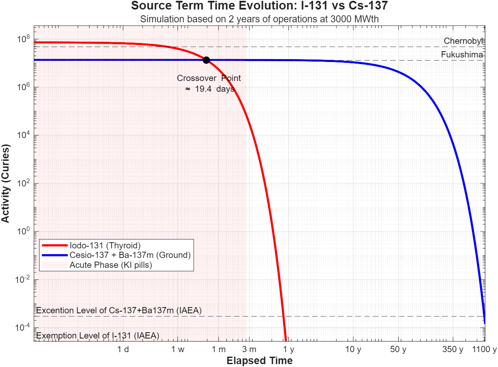
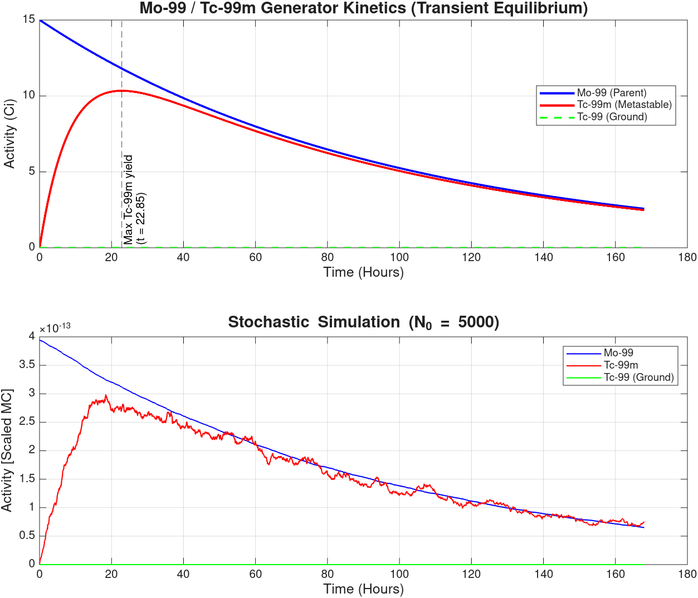
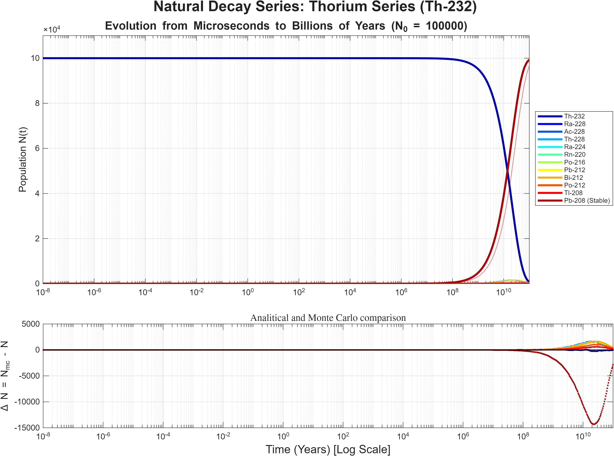

# Computational Nuclear Physics: Decay Chains & Source Term Simulation

This repository provides a comprehensive MATLAB framework for simulating radioactive decay kinetics. It bridges theoretical physics with nuclear engineering applications, implementing three distinct computational approaches to solve coupled differential equations: **Recursive (Bateman)**, **Matrix Exponential (Linear Algebra)**, and **Stochastic (Monte Carlo)**.

A key feature of this repository is the **Nuclear Accident Source Term Simulator**, which models the radiological evolution of a severe reactor accident (I-131 vs. Cs-137) over millennial timescales.

---

## 1. Mathematical Framework & Solvers

The evolution of a decay chain is governed by the **Law of Radioactive Decay**. This framework implements three solvers to handle systems ranging from simple parent-daughter pairs to complex branching networks.

### A. Recursive Approach (Bateman Equations)
*Ideal for linear chains and educational validation.*

For a linear chain $1 \to 2 \to \dots \to n$, the population of the $n$-th isotope at time $t$ is derived analytically:

$$
N_k(t) = \sum_{n=1}^k C_{kn}e^{-\lambda_nt}, \quad \text{where } 
C_{kn} = 
\begin{cases} 
   C_{k-1,n}\frac{\lambda_{k-1}}{\lambda_k-\lambda_n}, & n \neq k \\
   N_k(0) - \sum_{n=1}^{k-1}C_{kn}, & n=k 
\end{cases}
$$

Implemented in `DecayChain.m`. This method calculates the coefficients $C_{kn}$ recursively, ensuring exact solutions for non-looping chains.

### B. Matrix Formalism (Linear Algebra)
*Used for the Source Term Simulation and complex branching.*

To handle complex topologies and stiff systems, we represent the system as a first-order differential equation:

$$\frac{d\mathbf{N}(t)}{dt} = \mathbf{\Lambda} \mathbf{N}(t)$$

Where $\mathbf{\Lambda}$ is the **Transition Rate Matrix**. The solution is obtained via the **Matrix Exponential**:

$$\mathbf{N}(t) = \exp(\mathbf{\Lambda} t) \mathbf{N}_0$$

Implemented in `DecayMatrix.m` using MATLAB's `expm()` (Padé approximation), providing robust stability for systems with widely varying half-lives.

### C. Stochastic Simulation (Monte Carlo)
*Used for analyzing quantum fluctuations in low-activity regimes.*

Implemented in `DecayMonteCarlo.m`, this solver discretizes time and uses **Binomial** and **Multinomial** distributions to simulate the probabilistic nature of individual decay events. Useful for small $N$.

---

## 2. Main Application: Nuclear Accident Source Term
*(Script: `NuclearAccident.m`)*

This module simulates the release and evolution of the **Source Term** for a commercial nuclear reactor (e.g., 3000 MWth). It compares the radiological toxicity of **Iodine-131** (Acute Hazard) and **Cesium-137** (Chronic Hazard).

### Physical Model
1.  **Fission Rate:** Derived from thermal power ($P_{th}$) and energy per fission ($\approx 200$ MeV):
    $$R_{\text{fission}} \approx P_{\text{th}} \times 3.1 \times 10^{16} \text{ fissions/s}$$
2.  **Core Inventory:** Calculates the saturation activity for short-lived isotopes (I-131) and linear accumulation for long-lived ones (Cs-137) based on reactor operation time.
3.  **Safety Limits:** Benchmarked against **UNSCEAR 2000** data (Chernobyl release) and **IAEA GSR Part 3** (Exemption levels).

### Key Insights & Analysis
* **The Crossover Point:** The simulation identifies the exact moment (approx. 20-30 days post-accident) when the radiological dominance shifts from the thyroid-targeting I-131 to the whole-body irradiation threat of Cs-137.
* **The "Alpha" Discrepancy:** The simulation shows Gamma activity dropping to safe levels after $\approx 1,000$ years. This contrasts with the 20,000-year uninhabitable zone often cited for Chernobyl, which is driven by soil contamination from **Plutonium-239** (Alpha emitters) and not the Fission Products modeled here.

---

## 3. Other Simulation Modules

### A. Medical Isotope Generator ($^{99}\text{Mo}/^{99m}\text{Tc}$)
*(Script: `Molibdeno_99.m`)*
Models the transient equilibrium in technetium generators.
* **Physics:** Simulates the branching ratio where $87.6\%$ of Mo-99 decays to the metastable state.
* **Optimization:** Identifies the **Maximum Yield Time** ($t \approx 23$ h) for optimal "milking" of the generator for nuclear medicine imaging.

### B. Natural Decay Series (Geochronology)
*(Script: `Natural_Chains.m`)*
Simulates the four primordial decay series ($4n$ to $4n+3$).
* **Numerical Handling:** Utilizes logarithmic time scales to handle the stiffness between $^{238}\text{U}$ ($4.5 \text{ Gy}$) and $^{214}\text{Po}$ ($164 \text{ }\mu\text{s}$).

---

## 4. Dependencies & Usage
* **MATLAB R2018b** or later.
* **Statistics and Machine Learning Toolbox** (Required only for `DecayMonteCarlo.m`).

To run the Source Term simulation:
1.  Ensure `DecayMatrix.m`, `DecayMonteCarlo.m` and `DecayChain.m` in your path.
2.  Run `NuclearAccident.m` or any of the other example scripts.
3.  Input the requested values for the script.

## 📜 License
This project is open-source under the MIT License.

## 📬 Contact
Created by **Diego Franco** - B.Sc. Physics Candidate & Data Science Practitioner.
[LinkedIn](https://www.linkedin.com/in/diegofranco2410/) | [Email](mailto:diegofranco2410@gmail.com)
